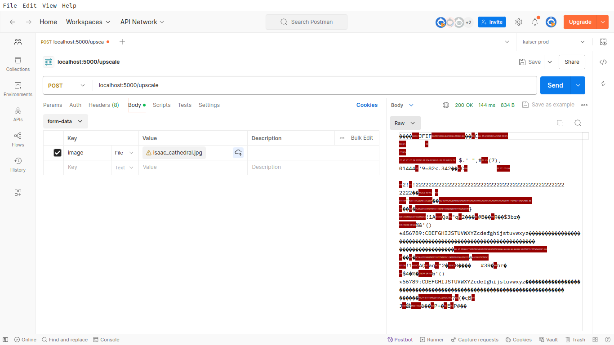
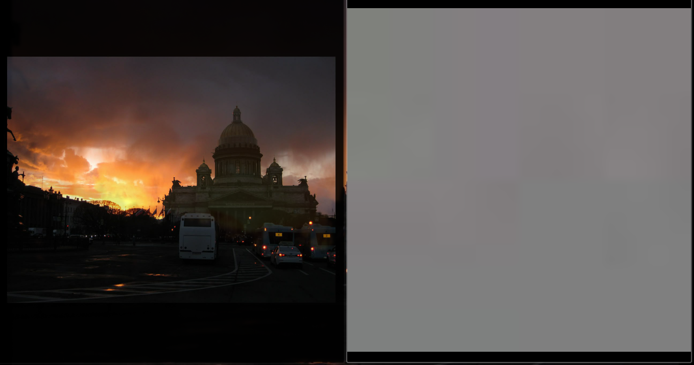
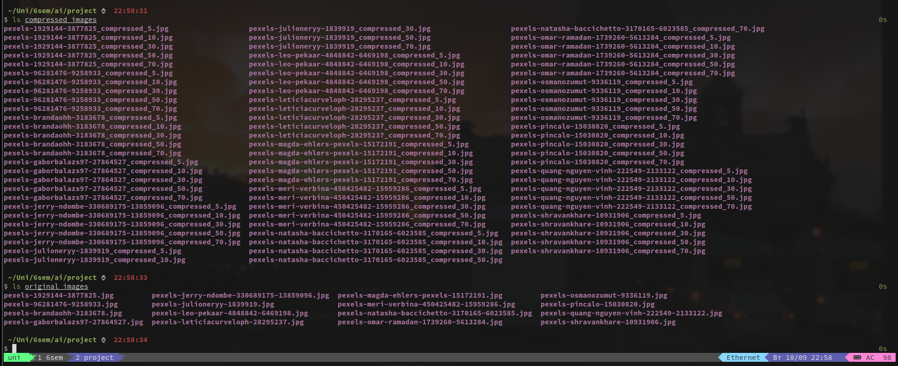
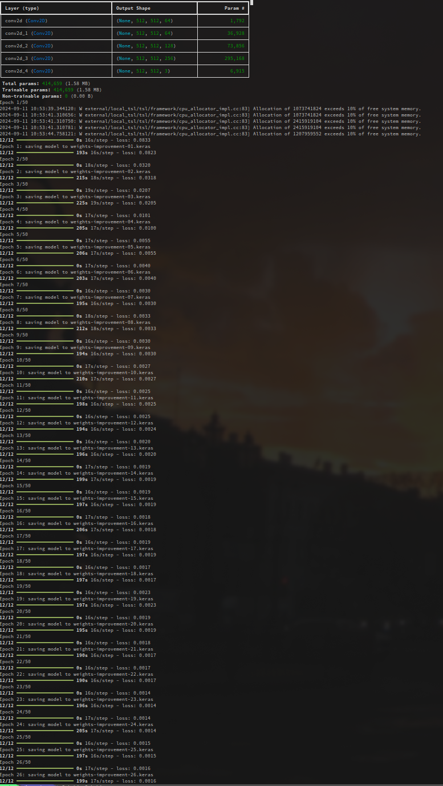
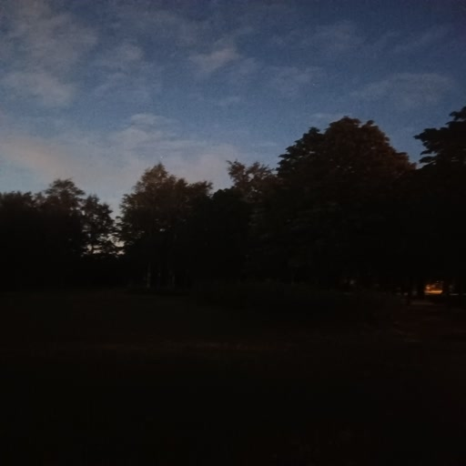
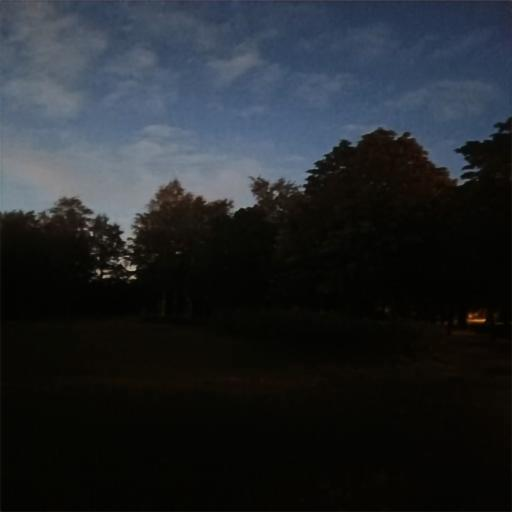
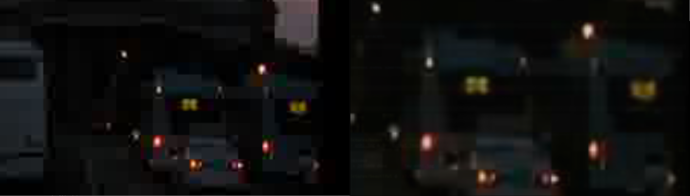

# ТЕХНИЧЕСКОЕ ЗАДАНИЕ

Итоговый продукт должен улучшать качество входящих изображений. Входные данные: изображения. Выходные данные: изображение более высокого качества.

# ВЫБОР СПОСОБА РЕАЛИЗАЦИИ

Итоговый продукт будет представлен в виде сервиса, реализующего API, получающее на вход изображение, отдающее на выходе исходное изображение с улучшенным качеством. Сервис будет написан на языке python с использованием библиотек tensorflow и flask.

# ОПИСАНИЕ РЕАЛИЗАЦИИ

Реализация проекта происходит в несколько этапов:

1. Написание сервиса, реализующего API
2. Формирование дата сета;
3. Обучение модели;
4. Проверка работоспособности на изображениях из датасета;
5. Проверка работоспособности на произвольных изображениях;

# РАЗРАБОТКА СЕРВИСА

Для начала был разработан сервис, реализующий API /upscale, которое принимает файл в формате form-data в поле image и возвращает улучшенное изображение.

На листингах 1 и 2 представлен код сервиса: модули model.py, представляющий собой модель, которая будет осуществлять улучшение качества изображения, и server.py, представляющий собой точку входа приложения, запускающую flask сервер, принимающий POST запрос по пути /upscale, прогоняющий изображение через модель и возвращающий ответ пользователю.

~~~{.py include=./project/model.py caption="код модели"}
~~~

~~~{.py include=./project/server.py caption="код сервера"}
~~~

На рисунках 1 и 2 представлена демонстрация работы сервиса на нетренированной модели:

# ДАТАСЕТ

Для создания датасета был сделан скрипт, который для каждого изображения из директории original_images создаёт изображения с качеством в 5, 10, 30, 50 и 70 процентов от изначального.

На листинге 3 представлен код этого скрипта.

~~~{.bash include=./project/generate_dataset.sh caption="Код генератора датасета"}
~~~

# ОБУЧЕНИЕ

Для обучения модели также был написан скрипт. Данный скрипт, код которого представлен в листинге 4, загружает датасет, проходя по каждому изображению из директории со сжатыми изображениями, находит его оригинал в директории с оригинальными изображениями и сохраняет их в массивы X и Y, которые позже загружает в модель для её тренировки. После тренировки модель сохраняется в файл.

~~~{.py include=./project/train.py caption="скрипт тренировки"}
~~~

# ПРОВЕРКА РАБОТОСПОСОБНОСТИ НА ИЗОБРАЖЕНИЯХ ИЗ ДАТАСЕТА

На рисунках 5-15 представлены примеры работы сервиса на изображении из датасета с разным разрешением.

 

 

 

 

 

# ПРОВЕРКА РАБОТОСПОСОБНОСТИ НА ПРОИЗВОЛЬНЫХ ИЗОБРАЖЕНИЯХ

На рисунках 16-20 представлены примеры работы сервиса на изображениях не из датасета.

 

 

Невооружённым глазом заметить разницу сложно, но если приглядеться, изменения очень заметны:

# ЗАКЛЮЧЕНИЕ

В ходе работы над проектом “Сервис для улучшения качества изображений на базе нейросети” был разработан сервис, составлена модель и натренерована нейронная сеть. Исходный код доступен по ссылке: https://github.com/goodhumored/image_upscale. Итоговый продукт может улучшать качество изображений. Чтобы улучшить работу сети, необходимо дообучить её на более объемном датасете.

# СПИСОК ИСПОЛЬЗУЕМЫХ ИСТОЧНИКОВ

1. Документация tensorflow [Электронный ресурс]. URL:

https://www.tensorflow.org/api_docs

2. Документация keras [Электронный ресурс]. URL: 

https://keras.io/api/

3. Репозиторий бесплатных изображений Pexels [Электронный ресурс]. URL:

https://www.tensorflow.org/

